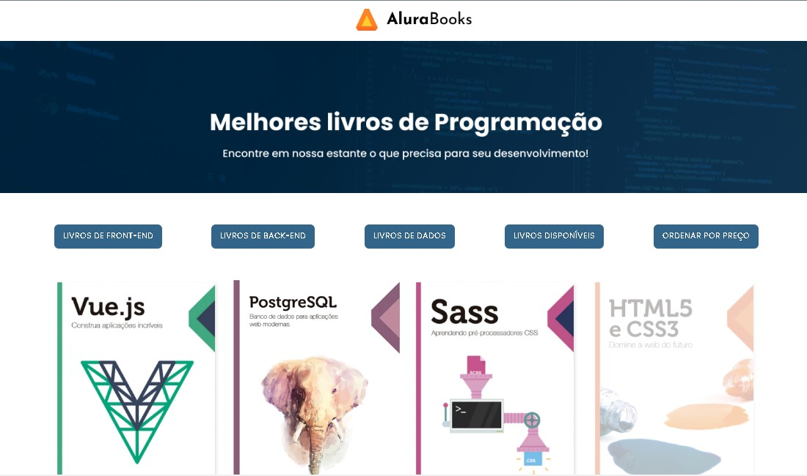

  

  

Este projeto tem como objetivo trabalhar com uma API que disponibiliza uma lista de objetos, e apartir destas informações utilizar o javascript para exibir essas informações na tela.

## Oque eu aprendi
<ul>
    <li>Trabalhar com metodos filter, forEach, reduce e sort.</li>
</ul>

## Tecnologias utilizadas durante o curso
* Javascript

## Tecnologias utilizadas no projeto
* HTML
* CSS